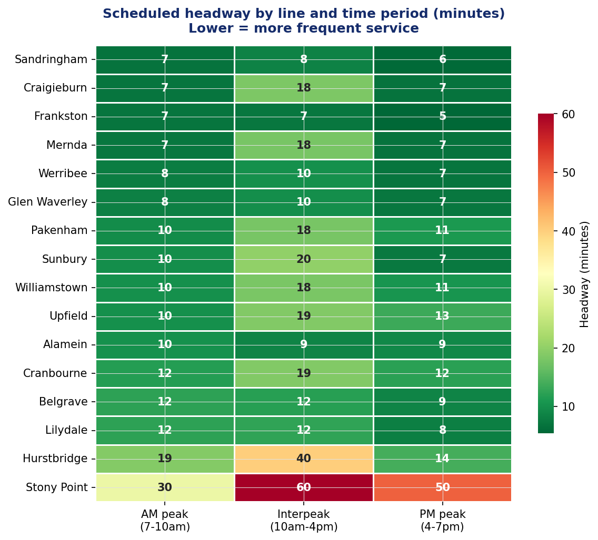

# Melbourne Metro Train — Timetable & Demand Analysis

> **Which lines have the biggest frequency gaps, and does current service supply match where passengers actually travel?**

A timetable evaluation project using real GTFS schedule data and Transport Victoria patronage statistics. Built to demonstrate analytical skills relevant to network planning and timetable evaluation roles.

---



---

## Key findings

**1. Stony Point has the largest service gap on the network** — a scheduled train every 30 minutes in the AM peak and every 50 minutes in the PM peak. Most other corridors run between 6–12 minutes. Stony Point is a diesel branch line connecting at Frankston, operationally distinct from the electrified metro network — further investigation into passenger demand on this corridor would determine whether the frequency gap is a priority issue.

**2. CBD stations have a severe PM peak skew — Parliament at 71.6% of daily travel in PM peak alone**
Passengers overwhelmingly leave the CBD in the evening rather than arrive in the morning. Parliament Station sees 71.6% of its daily weekday entries in the PM peak vs only 3.8% in AM peak. Flagstaff (68.4% PM) and Southern Cross (64.7% PM) show the same pattern. This asymmetry has direct implications for timetable capacity planning — outbound PM services carry far more load than inbound AM.

**3. Sunbury corridor runs 1,212 trips/weekday — 25% more than second-placed Frankston (972)**
This reflects multi-line sharing through the City Loop. The headway figure for Sunbury (0.7 min) is a product of multiple lines sharing the same stops — it should be interpreted as corridor frequency, not a single-line figure.

**4. Network patronage has recovered to 75.8% of pre-COVID baseline**
Recent monthly average: 15.3M passengers. Pre-COVID average: 20.2M. The ~4.9M monthly gap suggests the current timetable may be calibrated to 2019 demand patterns that no longer fully apply — a relevant consideration for any timetable review.

---

## Methodology Note

Frequency is calculated by counting unique departures at each line's true outer terminus, using full-length terminus-to-terminus services only. This method is applied consistently across all 16 lines to ensure like-for-like comparison.

Departure times are deduplicated before counting — the GTFS calendar contains multiple overlapping service_ids (e.g. T5, T5_1, T5_2) that represent the same physical train. Without deduplication, each journey appears 2–3 times, artificially inflating frequency. Deduplication on exact departure minute ensures each train is counted once.

Figures represent scheduled frequency at the outer terminus only. Frequency at intermediate stops will be higher as short-running services also call there. This analysis is based on scheduled timetable data only — actual frequency may 
differ due to delays, cancellations or substitutions.

---

## Data sources

| File | Source | What it contains |
|------|--------|-----------------|
| GTFS static feed (`routes.txt`, `trips.txt`, `stop_times.txt`, `stops.txt`, `calendar.txt`) | [Transport Victoria Open Data](https://opendata.transport.vic.gov.au/dataset/gtfs-schedule) | Full scheduled timetable — 10,125 weekday trips across 17 lines, 609,000 stop-time records |
| `annual_metropolitan_train_station_entries_fy_2024_2025.csv` | [Transport Victoria Open Data](https://discover.data.vic.gov.au) | Annual and time-of-day patronage per station, FY2024-25 |
| `monthly_public_transport_patronage_by_mode2.csv` | [Transport Victoria Open Data](https://discover.data.vic.gov.au) | Monthly ridership by mode, January 2018 – January 2026 |

All data is publicly available under Creative Commons Attribution 4.0.

---

## Note on stop_times.txt

`stop_times.txt` exceeds GitHub's 25MB file limit and is not included in this repo.

To run the notebook:
1. Go to https://opendata.transport.vic.gov.au/dataset/gtfs-schedule
2. Download the GTFS zip file
3. Extract `stop_times.txt` and place it in the `data/` folder

All other data files are included.

---

## Repo structure

```
melbourne-train-analysis/
├── README.md
├── melbourne_train_analysis.ipynb    ← run this
├── data/                             ← put downloaded files here
├── outputs/                          ← charts and CSV exports
└── docs/
    └── findings_brief.md
```

## How to run

```bash
pip install pandas matplotlib seaborn jupyter
jupyter notebook
# Open melbourne_train_analysis.ipynb → Run All
```

Requires Python 3. Uses `sqlite3` (built-in) — no database installation needed.

---

## Tools

`Python 3` · `pandas` · `SQLite / sqlite3` · `SQL` · `matplotlib` · `seaborn`

GTFS data covers the current timetable window (May–August 2026), updated weekly by Transport Victoria.
